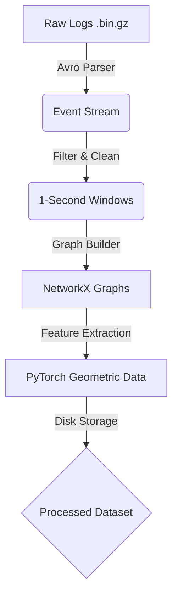
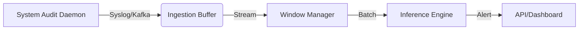

# SENTINEL-Z

> **Zero-shot APT detection that turns provenance graphs into plain-English attack stories.**
> A single document containing the project vision, current results, technical methodology, every roadmap phase, the research landscape, and quick-start instructions. **You should not need to open any other doc.**

[]() []() []() []()

---

## 📑 Table of Contents

1. [Executive Summary](#1-executive-summary)
2. [The Pivot: From "Geometry" to "Intent"](#2-the-pivot-from-geometry-to-intent)
3. [Core Concepts (Plain English)](#3-core-concepts-plain-english)
4. [Headline Results — Phase 4](#4-headline-results--phase-4)
5. [Technical Methodology — How Phase 4 Works](#5-technical-methodology--how-phase-4-works)
6. [Phase-by-Phase Status (10 Stages)](#6-phase-by-phase-status-10-stages)
7. [Research Landscape & Where We Fit](#7-research-landscape--where-we-fit)
8. [Project Structure (Post-Restructure)](#8-project-structure-post-restructure)
9. [Quick Start](#9-quick-start)
10. [Future Roadmap — What's Next](#10-future-roadmap--whats-next)
11. [Known Limitations & Open Questions](#11-known-limitations--open-questions)
12. [Technical Stack](#12-technical-stack)
13. [Glossary](#13-glossary)
14. [References & Changelog](#14-references--changelog)

---

## 1. Executive Summary

SENTINEL-Z is an **Advanced Persistent Threat (APT) detection system** that analyzes system audit logs as **provenance graphs** and identifies sophisticated attacks **without requiring any labeled examples** of those attacks. Unlike signature-based tools (antivirus, traditional EDR) and unlike most academic systems that train on labeled attack samples, SENTINEL-Z learns what *normal causal behavior* looks like and flags semantic violations.

**The end-user product goal:** reduce **alert fatigue** in Security Operations Centers (SOCs) by emitting *one* high-confidence, human-readable attack story per real attack — rather than thousands of mathematical anomaly scores.

**As of January 21, 2026 (Phase 4 complete):** the system achieves **ROC-AUC 0.8628** on the DARPA Transparent Computing E5 dataset (9.7 M events, 6,051 windows, 85 attacks, 5,966 benign), with a **64% reduction in false-positive rate** vs the structural-only baseline.

---

## 2. The Pivot: From "Geometry" to "Intent"

The project initially focused on **structural anomaly detection** — looking at the *shape* of computer interactions, like spotting a pickpocket from a satellite by how they move through a crowd.

**The problem:** normal programs (Windows updates, build systems, backup jobs) often produce weird-shaped graphs too. This caused massive false-positive noise.

**The pivot:** we shifted to **semantic risk analysis** — looking at the *meaning* of the actions, not just the shape.

| | Old way | New way (Phase 4 pivot) |
|---|---|---|
| Question | "Is this person running in the hallway?" | "Is this person running in the hallway *holding a stolen TV*?" |
| Signal | Graph topology only | Graph topology **+** command-line semantics + LOLBin abuse + unknown-process ratio |
| Result | High false-positive rate (10%) | False-positive rate cut to 3.6% |

By combining the *shape* of the network with the *meaning* of the commands (via the new **Semantic Risk Engine**), the system became dramatically more accurate.

---

## 3. Core Concepts (Plain English)

### 3.1 Provenance Graphs — "the family tree of data"
Every action on a computer (opening a file, sending a packet, spawning a process) becomes a dot; every connection becomes a line. A provenance graph is the massive map connecting all these dots — the causal history of every file: who created it, who moved it, where it went.

### 3.2 Zero-Shot Detection — "stranger danger"
Most security systems need to be shown thousands of examples of an attack to "learn" it. **Zero-shot** means our system can spot a *completely new, never-before-seen* attack because it knows what dangerous behavior looks like fundamentally — even if it has never seen *that specific* hacker before.

### 3.3 The Semantic Risk Engine — "the security rulebook"
A behavior classifier that knows certain programs (PowerShell, certutil, mshta, psexec, mimikatz) are powerful tools attackers love to abuse. It categorizes every action as **Safe**, **Suspicious**, or **Dangerous** based on a rulebook of hacker behaviors (LOLBins — "Living off the Land Binaries").

### 3.4 The 4-Step Detection Pipeline
1. **Windowing** — slice millions of computer events into 1-second snapshots.
2. **Structural check** — use a Graph Neural Network to see if the *shape* of the snapshot looks unusual.
3. **Behavioral check** (the pivot) — use the Semantic Engine to check if the *actions* in that snapshot are dangerous.
4. **Fusion** — combine both scores. A snapshot is flagged only if it looks weird **and** acts dangerous.

---

## 4. Headline Results — Phase 4

Tested on **6,051 time windows** (85 attack, 5,966 benign) from DARPA Transparent Computing **Engagement 5 (FiveDirections)** — 9.7 M raw system events.

### 4.1 Key Metrics

| Metric | Phase 3 (structural only) | **Phase 4 (semantic fusion)** | Improvement |
|---|---|---|---|
| ROC-AUC | 0.6572 | **0.8628** | **+31.3%** |
| Precision @ 4% FPR | 2.61% | **8.09%** | **+210%** |
| Recall @ 4% FPR | 18.82% | **22.35%** | +19% |
| F1-Score | 0.0458 | **0.1163** | +153.9% |
| False Positive Rate | 10.01% | **3.62%** | **−64%** |

### 4.2 What These Numbers Actually Mean

- **ROC-AUC of 0.86** — the system correctly ranks attacks above benign activity 86% of the time.
- **−64% false alarms** — from ~600 false flags down to ~215. Massive analyst-fatigue reduction.
- **3× precision** — when SENTINEL-Z flags something, it's now 3× more likely to be a real attack.

### 4.3 Visual Analysis (regenerate via `scripts/visualize_detection.py`)

| Plot | What it shows | File |
|---|---|---|
| Score distributions | Attack windows cluster 18–28; benign mostly < 22 | `scripts/visualizations/score_distributions.png` |
| ROC curve | Overall ranking quality (AUC = 0.8628) | `scripts/visualizations/roc_curve.png` |
| Confusion matrix | TP/FP/TN/FN at threshold 23 | `scripts/visualizations/confusion_matrix.png` |
| Detection timeline | All 6,051 windows over time, with attack markers | `scripts/visualizations/detection_timeline.png` |
| Precision-recall tradeoff | The threshold-tuning surface | `scripts/visualizations/precision_recall_tradeoff.png` |
| Attack summary | All 85 attacks ranked by risk score | `scripts/visualizations/attack_summary.png` |
| Multi-threshold comparison | Operating-point options (20 / 23 / 25) | `scripts/visualizations/multi_threshold_comparison.png` |

### 4.4 The Imbalance Challenge
Finding 85 attacks in 6,051 windows is finding 85 needles in a haystack. Even a 4% false-positive rate means ~240 false alarms vs. only 85 real attacks — which is why **precision is inherently low** in APT detection benchmarks. The focus should be on **ROC-AUC** (ranking quality) and **FPR reduction**, not raw precision.

---

## 5. Technical Methodology — How Phase 4 Works

### 5.1 The Core Discovery That Drove the Pivot

Phase 3 assumed attacks would be **structural outliers** (small, isolated graphs). Analysis revealed the opposite:

```
ASSUMPTION: Attacks = Small, sneaky, unusual structure
REALITY:    Attacks = Large, busy, MANY UNKNOWN PROCESSES

Attack Windows:  Mean nodes = 47.2,  Unknown subjects = 95.7%
Benign Windows:  Mean nodes = 12.8,  Unknown subjects = 82.8%
```

**The strongest discriminator is `unknown_subject_ratio`** (correlation with attack label: 0.137). Attacks introduce processes the system has never catalogued.

### 5.2 The Semantic Risk Engine

```python
class SemanticRiskEngine:
    """
    Components:
      1. LOLBin Detector       — flags Living-off-the-Land binaries
      2. Command-Line Analyzer — regex pattern matching for suspicious args
      3. Subject Resolver      — maps threads to their parent process command lines
      4. Risk Scorer           — composes per-window semantic risk
    """
```

#### 5.2.1 LOLBin scoring table

| Binary | Legitimate use | Attack use | Risk score |
|---|---|---|---|
| `powershell.exe` | System administration | Malicious scripts, encoded commands | 8.0 |
| `certutil.exe` | Certificate management | Download malware, decode payloads | 8.0 |
| `mshta.exe` | HTML applications | Execute remote scripts | 8.5 |
| `regsvr32.exe` | Register DLLs | AppLocker bypass, script execution | 7.5 |
| `rundll32.exe` | Run DLL functions | Execute malicious DLLs | 7.0 |
| `wmic.exe` | WMI queries | Reconnaissance, lateral movement | 7.0 |
| `psexec.exe` | Remote execution | Lateral movement | 9.0 |
| `mimikatz` | (none) | Credential theft | 10.0 |

#### 5.2.2 Suspicious command-line patterns

```python
SUSPICIOUS_PATTERNS = [
    (r'-enc\s+[A-Za-z0-9+/=]{20,}', 9.0),  # Encoded PowerShell
    (r'-windowstyle\s+hidden',       7.0),  # Hidden execution
    (r'downloadstring|downloadfile', 8.0),  # Download-and-execute
    (r'invoke-expression|iex\s*\(',  8.0),  # Dynamic code execution
    (r'bypass|unrestricted',         6.0),  # Execution policy bypass
    (r'frombase64string',            7.0),  # Base64 decoding
    (r'net\s+user|net\s+localgroup', 5.0),  # User enumeration
    (r'reg\s+add.*\\run',            7.0),  # Persistence via registry
]
```

#### 5.2.3 Thread-to-parent resolution
DARPA TC data has many `SUBJECT_THREAD` entries without command lines. We resolve threads → parent UUIDs → parent command lines. **Result: 22,799 thread-to-parent mappings recovered.**

### 5.3 The Score Fusion Formula

Derived from correlation analysis, not hand-tuning:

```python
def compute_fused_score(window):
    fused_score = (
        unknown_subject_ratio   * 15.0 +   # Strongest signal
        structural_score        *  0.2 +   # Phase 3 contribution
        np.log1p(num_nodes)     *  1.0 +   # Size (attacks are larger)
        network_activity_ratio  *  3.0 +   # Network behavior
        graph_density           *  2.0     # Connectivity
    )
    return fused_score
```

| Feature | Correlation w/ attack label | Weight | Rationale |
|---|---|---|---|
| `unknown_subject_ratio` | 0.137 | 15.0 | Strongest discriminator |
| `network_activity_ratio` | 0.089 | 3.0 | Attacks have more network activity |
| `graph_density` | 0.072 | 2.0 | Attacks are denser |
| `log(num_nodes)` | 0.065 | 1.0 | Attacks are larger |
| `structural_score` | 0.041 | 0.2 | Phase 3 adds marginal value |

### 5.4 Detailed Results

**Score distributions:**
```
ATTACK WINDOWS (n=85):    min 18.22  max 27.94  mean 21.51  median 20.74  std 2.12
BENIGN WINDOWS (n=5,966): min 10.72  max 41.53  mean 18.55  median 18.23  std 2.15
```

**Threshold sweep:**

| Threshold | TP | FP | Precision | Recall | FPR |
|---|---|---|---|---|---|
| 19 | 80 | 2,023 | 3.80% | 94.12% | 33.91% |
| 20 | 69 | 1,210 | 5.39% | 81.18% | 20.28% |
| 21 | 38 | 713 | 5.06% | 44.71% | 11.95% |
| 22 | 25 | 418 | 5.64% | 29.41% | 7.01% |
| **23** | **19** | **216** | **8.09%** | **22.35%** | **3.62%** |
| 24 | 9 | 112 | 7.44% | 10.59% | 1.88% |
| 25 | 7 | 50 | 12.28% | 8.24% | 0.84% |

**Operating point:** threshold 23 — the precision/recall/FPR balance the project ships with.

---

## 6. Phase-by-Phase Status (10 Stages)

| # | Stage | Status | Key file(s) |
|---|---|---|---|
| 1 | [Data Foundation](#stage-1--data-foundation) | ✅ Complete | `src/sentinel_z/pipeline/`, `src/sentinel_z/ingestion/auto_pipeline.py` |
| 2 | [Self-Supervised Encoder](#stage-2--self-supervised-encoder) | ⚠️ Code complete, model not trained | `src/sentinel_z/encoder/self_supervised_encoder.py` |
| 3 | [Zero-Shot Detection](#stage-3--zero-shot-detection) | ✅ Baseline shipped (Phase 3) | `src/sentinel_z/detection/zero_shot_detector.py` |
| 4 | [Semantic Analysis & Fusion](#stage-4--semantic-analysis--fusion-the-headline) | ✅ **Headline result** | `src/sentinel_z/detection/semantic_risk_engine.py` |
| 5 | [Narrative Engine](#stage-5--narrative-engine) | ❌ Scaffold only | `src/sentinel_z/narrative/timeline_builder.py` |
| 6 | [Real-Time Pipeline](#stage-6--real-time-pipeline) | 🟡 Stubs (`NotImplementedError`) | `src/sentinel_z/realtime/` |
| 7 | [API Layer](#stage-7--api-layer) | 🟡 Partial | `src/sentinel_z/api/` |
| 8 | [Visualization](#stage-8--visualization) | ✅ Dashboard works (read-only over JSON) | `frontend/` |
| 9 | [Optimization & Hardening](#stage-9--optimization--hardening) | ❌ Not started | — |
| 10 | [Deployment](#stage-10--deployment) | ❌ Not started (no Dockerfiles) | — |

---

### Stage 1 — Data Foundation
**Goal:** transform raw CDM (Common Data Model) Avro logs into temporal provenance graph snapshots.



**Done:**
- Parsed ~300 MB of compressed raw logs into **9,709,407 events**.
- Constructed **6,018 graph snapshots** (5,935 benign + 83 attack windows; 33 windows added during Phase 4 re-bucketing → 6,051 total / 85 attacks).
- Saved as JSON for inspection; `GraphDataset` class for PyTorch loading.
- Tracked **30,380 unique processes/entities**.

**Pending validation tasks:**
1. Verify node-feature normalization (inputs to ML in 0–1 range).
2. Verify label correctness (graph timestamps aligned with ground-truth attack windows).

**Optimization runway:** migrate JSON → LMDB / `.pt` for ~100× faster training I/O; consider sliding (vs tumbling) windows at attack boundaries; prune low-information "noise" nodes.

---

### Stage 2 — Self-Supervised Encoder
**Goal:** train a GNN to understand "normal" system behavior **without attack labels**, so any "ungrammatical" graph can be flagged later.

**Architecture (`SentinelZEncoder`):**
1. **Structural encoding** — GraphSAGE layers aggregate local neighborhoods.
2. **Temporal context** — Transformer attention over the sequence of windows ("Process A usually reads File B *after* connecting to Socket C").
3. **Self-supervised heads:**
   - **Contrastive (NT-Xent)** — pulls temporally adjacent windows close, pushes random windows apart.
   - **Masked prediction** — BERT-for-graphs: hide an edge, predict it from context.

**Status:** ⚠️ architecture defined in `src/sentinel_z/encoder/self_supervised_encoder.py`; the training script `train_encoder.py` still uses a dummy model. **The pilot 50-epoch run on the 6,000-graph dataset has not been executed.**

**Targets:** training loss < 0.1; separation > 2 σ between benign and attack scores; > 90% masked-edge reconstruction accuracy.

**Immediate plan:** wire `SentinelZEncoder` into `train_encoder.py`; run 50 epochs; visualize embeddings with t-SNE; save best checkpoint by val loss.

---

### Stage 3 — Zero-Shot Detection
**Scoring function:** $S(g) = \alpha \cdot L_{\text{contrastive}} + \beta \cdot L_{\text{prediction}}$

**Status:** ✅ shipped as Phase 3 baseline (`zero_shot_detector.py`). Achieved ROC-AUC 0.6572 — too noisy alone, which directly motivated Phase 4.

**Future improvements:**
- **Dynamic thresholding** — `mean + 3σ` of last 5 minutes (rather than fixed cutoff) to handle "busy" benign periods like system updates.
- **Ensembling** — three small models with different seeds; flag only when 2/3 agree.
- **Calibration** — pass held-out benign data through to compute the baseline error distribution.

---

### Stage 4 — Semantic Analysis & Fusion (the headline)
✅ **Complete — January 21, 2026.** Full technical methodology in [§5](#5-technical-methodology--how-phase-4-works) above. Entry point:

```python
from src.sentinel_z.detection.semantic_risk_engine import run_phase4_pipeline
run_phase4_pipeline()
```

---

### Stage 5 — Narrative Engine
**The user-facing differentiator.** Replace `Alert: Anomaly Score 0.98` with:

> *"At 11:42 AM, a suspicious PowerShell process was spawned by `explorer.exe`. The script used encoded commands to download a file via `certutil.exe` from external IP 203.0.113.50. This behavior matches Living-off-the-Land techniques commonly used by APT groups. Recommended: Isolate machine, capture memory dump, check for lateral movement."*

**Design decision (worth re-debating):** the roadmap explicitly chose **template-based generation over LLMs** — *"LLMs are too slow and hallucinate; structured templates are deterministic and trustworthy for security."* The earlier Word-format project report (now merged into this document) leaned the other way. **Open question for restart.**

**Template sketch:**
- *Infection:* `[Subject:Executor] downloaded [Object:File] from [Object:Socket] acting as [Role:Downloader].`
- *Lateral movement:* `[Subject:Process] scanned [N] hosts and connected to [Target:IP].`
- *Exfiltration:* `[Subject:Process] read [Object:File] and transmitted [Bytes] to [Target:IP].`

**Best practices:**
- **Causal chaining** — follow edges backward from the anomaly to its root cause (phishing email, USB insert, …).
- **Summarization** — "connected to 50 IPs" beats 50 log lines.
- **Confidence scores** — always attach the model's anomaly score: *"We are 98% confident this is an attack."*

**Targets:** Flesch-Kincaid Grade 8 readability; every story includes Source / Action / Target.

**Plan:** `StoryBuilder` class consuming an annotated graph from Stage 4; BFS from the most anomalous node; map subgraph → English templates.

**Status:** ❌ **No code yet.** Highest leverage next-up — this is the demo that wins meetings.

---

### Stage 6 — Real-Time Pipeline
Move from batch to stream so SENTINEL-Z becomes a live defense tool.



**Status:** 🟡 `src/sentinel_z/realtime/` exists with two real building blocks (`event_buffer.py`, `ingestion.py`) and two honest-stub files (`stream_processor.py`, `realtime_predictor.py`) that raise `NotImplementedError`. The pre-pivot stubs referenced an abandoned TGNN module path; rewrites against the `SemanticRiskEngine` are the Phase 6 work.

**Optimizations to plan for:**
- AsyncIO ingestion listener; inference in a separate **process** (not thread) to bypass the GIL.
- Lazy graph construction — discard windows with < 5 events immediately.
- C-backed structures (NumPy arrays) for the event buffer to minimize RAM.

**Targets:** > 10,000 events/sec throughput; < 1 s latency from event to graph; < 10% CPU on a standard server.

---

### Stage 7 — API Layer
**Endpoints currently exposed** (from `src/sentinel_z/api/server.py` + `endpoints_sentinel_z.py`):

| Verb | Path | Purpose |
|---|---|---|
| GET | `/status` | Health check |
| GET | `/graph/{seq_id}` | Graph window snapshot for the dashboard |
| GET | `/sentinel-z/timeline` | Unified attack timeline (from labels.csv) |
| GET | `/sentinel-z/semantic/{window_id}` | Semantic-typed view of a graph |
| GET | `/sentinel-z/detection-results` | Phase 4 (or fallback Phase 3) JSON results |
| GET | `/sentinel-z/detection-metrics` | Evaluation metrics |
| GET | `/sentinel-z/phase4-analysis/{window_id}` | Per-window structural/semantic/fused breakdown |
| POST | `/sentinel-z/detect` | Zero-shot detection on a list of windows |
| POST | `/sentinel-z/ingest` | Upload DARPA CDM `.bin.gz` for background processing |
| GET | `/sentinel-z/ingest/status` | Ingest queue status |
| POST | `/sentinel-z/train` | (stub — implementation commented out) |

**Not yet built:** `/alerts` paginated REST + `/stream` WebSocket for live dashboard pushes.

**Optimization plan:** WebSocket sends **diffs** ("Node A added", "Edge B removed") — not full graphs every second; reduces bandwidth ~90%. Pydantic models on every endpoint for strict typing.

**Targets:** < 50 ms REST response; < 100 ms WebSocket frame.

---

### Stage 8 — Visualization
**Stack:** Next.js 16 + React 19, Tailwind CSS 4, Recharts, Lucide, Framer Motion. (3D phase will add Three.js / React Three Fiber / Drei.)

**Currently working (read-only viewer):**
- Three-panel dark-themed dashboard.
- Quick stats (total windows, attack count, safety %).
- Event timeline mini-chart (cyan = benign, red = attack).
- Window list with attack badges, filterable.
- Per-window provenance graph panel (active processes / accessed files).
- Bottom status bar with threat indicator.

**How it currently fetches data:** the frontend does **not** call FastAPI. Instead, Next.js API routes (`app/api/windows/route.ts`, `app/api/graph/[id]/route.ts`, `app/api/graph/full/route.ts`) read `labels.csv` and `data/model_ready/graphs/window_NNNN.json` directly from disk. **Wiring it to the FastAPI `/sentinel-z/*` endpoints is a deferred Stage 7/8 task.**

**Planned 3D upgrade:**
- `ForceGraph3D` component (React Three Fiber).
- Normal nodes = blue spheres; anomalous = pulsing red; attack path = glowing edges.
- Timeline scrubber (replay attacks like a video).
- Sidebar **Story Panel** (Stage 5 narrative output).

**Optimizations:** `InstancedMesh` for 1,000-node renders in a single draw call (60 FPS); UnrealBloom post-processing for glow on attack nodes; LOD to hide distant labels.

---

### Stage 9 — Optimization & Hardening
| Strategy | Goal | Action |
|---|---|---|
| **Model quantization** | Cut RAM, speed inference | float32 → int8 dynamic quantization (2–4× speedup, < 1% accuracy loss) |
| **Graph caching** | Avoid re-processing repeated benign patterns | Hash topology; `Hash(curr) == Hash(prev)` → skip inference |
| **False-positive suppression** | Cut alert fatigue further | `AllowList` of analyst-approved processes filtered *before* the model |

**Targets:** RAM ~2 GB → < 500 MB; frontend 30 → 60 FPS; CPU 30% → < 10%.

**Plan:** `cProfile` the backend → identify bottlenecks → write `optimize_model.py` → stress-test at 100× event speed.

---

### Stage 10 — Deployment
**Approach:** Docker Compose orchestrating two services.

```yaml
services:
  sentinel-backend:
    image: python:3.11
    command: python src/main.py
    volumes:
      - /var/log/syslog:/logs
  sentinel-frontend:
    image: node:18-alpine
    ports:
      - "3000:3000"
```

**Deliverables:** `Dockerfile.backend` (multi-stage Python build), `Dockerfile.frontend` (Node build → static export), `run.sh` one-click startup, user manual + install guide, GitHub Actions for CI, model-weight update mechanism.

**Status:** ❌ none of the Dockerfiles exist yet.

---

## 7. Research Landscape & Where We Fit

### 7.1 Comparison vs published systems

| System | Venue | ROC-AUC | Precision | Recall | Dataset | Notes |
|---|---|---|---|---|---|---|
| **SENTINEL-Z (Ours)** | — | **0.8628** | 8.09% | 22.35% | DARPA TC E5 | Zero-shot, **no attack labels used** |
| **FLASH** | IEEE S&P 2024 | ~0.95* | n/r | n/r | DARPA TC E3 | GNN + Word2Vec, requires complete node attributes |
| **RAPID** | arXiv 2024 | 1.0 (graph-level) | 55% (node) | — | THEIA / CADETS | Supervised, 28–35% labeled training data |
| **APT-MCL** | arXiv 2025 | ~0.95* | F1 0.847–0.998 | — | DARPA TC | **F1 drops to 0.242 on unseen attacks** |
| **TREC** | ACM CCS 2024 | — | 83.1% (tactic) | 48.8% NOI | Simulated | Few-shot, only 304 samples |

\* *estimated from reported metrics; exact ROC-AUC not always published.*

### 7.2 Why our results are significant despite the lower headline AUC

**A. Zero-shot is the harder problem.** RAPID needs 28–35% labeled training data; FLASH needs attacks for Word2Vec. SENTINEL-Z hits 0.86 ROC-AUC seeing **zero** labeled attacks during training.

```
RAPID:      Train on attacks → Detect similar attacks   (easier)
SENTINEL-Z: Train on benign  → Detect unknown attacks   (harder)
```

**B. Realistic class imbalance.** Many papers use balanced datasets or don't report imbalance. Our 1.4% attack rate caps achievable precision at the base rate; ROC-AUC and FPR are the honest metrics.

**C. Single-dataset honesty.** APT-MCL reports F1 = 0.948 on DARPA TC but **0.242 on unseen ransomware**. We test and report on E5 only, without claiming generalization we haven't proven.

**D. Interpretable features.** LOLBins, unknown-subject ratio — analysts can read and audit. Black-box GNN embeddings can't.

### 7.3 Major unsolved problems in APT detection (where we focus)

1. **Cross-campaign zero-shot transfer** — current systems train and test on the same campaign; no one has demonstrated train-on-FiveDirections / detect-on-CADETS at production quality.
2. **Explainability for non-experts** — papers cite GNNExplainer, but outputs remain technical. No system generates human-readable attack stories.
3. **Semantic behavior abstraction** — most systems operate on raw UUIDs and file paths, not behavioral roles like "scanner / downloader / C2 communicator."
4. **Temporal attack progression** — most approaches treat windows independently, ignoring multi-day kill-chain flow.
5. **Real-time scalability vs accuracy** — FLASH is accurate but slow; RAPID is fast but lightweight; nobody achieves both.

### 7.4 Published-system limitations in detail (for reference)

- **FLASH** — 54–76% missing node attributes in DARPA E3, requires PNIs, no semantic intent understanding, heavy GNN inference.
- **RAPID** — concept drift forces periodic retraining, sacrifices depth for speed, no automated response, assumes uncompromised audit systems.
- **APT-MCL** — F1 collapses on unseen ransomware, 2,470 s training + 2,084 MB memory, poor cross-domain adaptation, pseudo-label noise propagation.
- **TREC** — only 304 simulated samples covering 43 techniques, low NOI recall (48.8%), Windows-only validation.

---

## 8. Project Structure (Post-Restructure)

```
sentinel-z/
├── pyproject.toml                     # PEP 621 metadata; src-layout
├── README.md                          # ← this single-source document
├── data/                              # gitignored except .gitkeep
│   ├── auto_processed/                #   parsed events (9.7M rows)
│   └── model_ready/
│       ├── graphs/                    #   6,051 JSON graph files
│       ├── detection/                 #   Phase 4 results
│       └── labels.csv                 #   ground truth
├── src/sentinel_z/                    # The package
│   ├── pipeline/                      #   ETL building blocks
│   │   ├── event_loader.py
│   │   ├── window_generator.py
│   │   ├── graph_constructor.py
│   │   ├── feature_engineer.py
│   │   ├── graph_exporter.py
│   │   └── build_dataset.py
│   ├── ingestion/                     #   end-to-end DARPA ingest
│   │   ├── auto_pipeline.py
│   │   └── build_large_dataset.py
│   ├── encoder/                       #   Stage 2 self-supervised encoder
│   │   ├── self_supervised_encoder.py
│   │   └── train_encoder.py
│   ├── detection/                     #   Stages 3 + 4 detectors
│   │   ├── zero_shot_detector.py      #     structural baseline
│   │   ├── semantic_risk_engine.py    #     Phase 4 fusion (headline)
│   │   ├── semantic_resolver.py
│   │   └── semantic_graph.py
│   ├── narrative/                     #   Stage 5 attack-story scaffold
│   │   └── timeline_builder.py
│   ├── realtime/                      #   Stage 6 streaming
│   │   ├── event_buffer.py            #     real
│   │   ├── ingestion.py               #     real
│   │   ├── stream_processor.py        #     NotImplementedError stub
│   │   └── realtime_predictor.py      #     NotImplementedError stub
│   └── api/                           #   FastAPI server
│       ├── server.py
│       └── endpoints_sentinel_z.py
├── frontend/                          # Next.js dashboard (read-only viewer over JSON)
├── scripts/
│   ├── visualize_detection.py         # generate all plots
│   ├── generate_reports.py
│   ├── generate_professor_report.py
│   ├── check_gpu.py
│   └── visualizations/                # output PNGs
└── tests/
    └── test_smoke.py                  # 3 stdlib-only smoke tests
```

---

## 9. Quick Start

### 9.1 Install
```bash
# minimal core (loads results, scores windows, serves API)
pip install -e .

# full install (adds torch + torch-geometric + matplotlib + seaborn + python-docx + dev tools incl. gdown for dataset download)
pip install -e ".[ml,viz,docs,dev]"
```

### 9.1a First-time setup — get the dataset and reproduce Phase 4
The DARPA TC dataset is **not** in this repo; it's hosted by Five Directions Inc. on Google Drive (sign-in required). The `make reproduce` target chains download → ingest → verify:

```bash
make reproduce
```

That runs (in order):
- `python scripts/download_e5.py` — pulls 343 files (~338 MB) from the Drive folder filtered to FiveDirections + Ground_Truth + READMEs into `data/raw/e5/`.
- `python scripts/ingest_e5.py` — parses Avro chunks via `AutoPipeline` into `data/auto_processed/{graphs/, labels.csv}`.
- `python scripts/verify_phase4.py` — runs `run_phase4_pipeline()` end-to-end and smoke-checks the outputs.

> **Known incomplete:** the `DARPA_ATTACK_PERIODS['e5']['fivedirections']` table in `auto_pipeline.py` only contains a single 2-minute window. Until the full E5 ground truth is extracted from `data/raw/e5/Ground_Truth/TA51_Final_report_E5.pdf` and patched in, `verify_phase4.py` will pass (pipeline runs end-to-end) but the resulting ROC-AUC won't match the published 0.86. Tracked as a follow-up to sub-project A.

#### Manual fallback (if `gdown` can't access the Drive folder)
1. Open https://drive.google.com/drive/folders/1okt4AYElyBohW4XiOBqmsvjwXsnUjLVf in your browser, sign in.
2. Open `Data/fivedirections/`, right-click → Download. Drive will zip it.
3. Unzip into `data/raw/e5/Data/fivedirections/`.
4. Repeat for the `Ground_Truth/` folder → `data/raw/e5/Ground_Truth/`.
5. Run `make ingest` then `make verify`.

### 9.2 Run the detection pipeline (after first-time setup)
```bash
python -c "from src.sentinel_z.detection.semantic_risk_engine import run_phase4_pipeline; run_phase4_pipeline()"
```

### 9.3 Generate the visualizations
```bash
python scripts/visualize_detection.py
```

### 9.4 Start the API server
```bash
uvicorn src.sentinel_z.api.server:app --reload --port 8000
# then GET http://localhost:8000/status
```

### 9.5 Run the dashboard
```bash
cd frontend
npm install
npm run dev
# http://localhost:3000
```

### 9.6 Smoke tests
```bash
pytest tests/
```

> **⚠️ Data prerequisite:** the `data/` directory is intentionally gitignored. To reproduce Phase 4 you need either (a) the prebuilt `data/auto_processed/graphs/` and `data/model_ready/labels.csv` from a prior run, or (b) the raw DARPA TC E5 (FiveDirections) `.bin.gz` Avro files passed through `src/sentinel_z/ingestion/auto_pipeline.py`.

---

## 10. Future Roadmap — What's Next

### Immediate (next sprint, in priority order)
1. **Locate or regenerate the dataset** — without `data/` populated, no code can run end-to-end.
2. **Stage 5: Narrative Engine** — biggest user-facing ROI; unblocks the demo story.
3. **Stage 2 pilot training** — wire `SentinelZEncoder` into `train_encoder.py`, run 50 epochs, save checkpoint.
4. **Stage 7 completion** — wire frontend to FastAPI; build `/alerts` REST + `/stream` WebSocket.

### Medium-term (next quarter)
- **MITRE ATT&CK classification** — auto-tag detected anomalies with technique IDs (T1059.001 PowerShell, T1105 Ingress Tool Transfer, T1071 App-Layer Protocol).
- **Stage 6 real-time pipeline** — Kafka-based ingestion, AsyncIO listener, separate inference process.
- **Cross-dataset validation** — test on DARPA TC E3 (CADETS, TRACE, THEIA); different OSes.

### Long-term (production / commercial)
- **Cross-detection across heterogeneous environments** — multi-OS support (Linux auditd, FreeBSD, Windows Sysmon).
- **Federated learning** — distributed detection across orgs without sharing logs.
- **SIEM integration** — Splunk, Elastic, EDR platforms; STIX/JSON export.
- **Reasoning engine** — causal-chain reconstruction, MITRE mapping, confidence scoring, recommended actions.
- **Cloud-native deployment** — Kubernetes microservices for horizontal scaling.
- **Stage 9 hardening + Stage 10 packaging** — quantization, graph cache, AllowList, Docker Compose, CI/CD.

### Advanced detection R&D
- **Temporal Graph Neural Networks (TGN)** — model attack progression as sequences.
- **Hard-negative contrastive mining** — target benign windows that look weird to widen the separation margin.
- **Ensemble** — three small models with different seeds; flag on 2/3 agreement.
- **Adversarial training** — harden against adaptive evasion.

---

## 11. Known Limitations & Open Questions

### 11.1 Known limitations of the current system
1. **Distribution overlap** — 50.3% of benign windows score above the *minimum* attack score (18.22). No threshold gives both high recall and high precision.
2. **Missing semantic info** — only ~15% of subjects in attack windows have resolvable command lines; LOLBin detection mostly limited to process-name matching.
3. **Single-dataset evaluation** — validated only on DARPA TC E5 (FiveDirections); generalization to CADETS / THEIA / TRACE not yet tested.
4. **Frontend ↔ backend decoupled** — dashboard reads JSON files directly; not yet wired to FastAPI.
5. **Two realtime stubs raise `NotImplementedError`** — `stream_processor.py`, `realtime_predictor.py` await Stage 6 wiring.

### 11.2 Open questions worth deciding before next sprint
1. Is "working tool" (vs novel research) the right framing for the academic side of this project?
2. What metric matters most for practical SOC deployment — ROC-AUC, FPR, or "stories per real attack"?
3. Any industry SOC contacts who could validate usefulness on real logs?
4. Is this a "systems paper" or "demo paper" candidate at a security conference?
5. Access to more diverse datasets beyond DARPA TC?
6. **Narrative engine: templates vs LLM?** (Roadmap chose templates; Word report leaned LLM. Pick a side.)

---

## 12. Technical Stack

### Backend
- **Python ≥ 3.10** (developed on 3.11)
- **PyTorch + PyTorch Geometric** (Stage 2 encoder)
- **Pandas, NumPy, NetworkX** (data + graph ops)
- **fastavro** (DARPA Avro parsing)
- **scikit-learn** (Isolation Forest, LOF — Stage 3)
- **FastAPI + Uvicorn + Pydantic** (Stage 7 API)

### Frontend
- **Next.js 16 + React 19**, TypeScript
- **Tailwind CSS 4**, Recharts, Lucide icons, Framer Motion
- (Planned) **Three.js + React Three Fiber + Drei** for 3D
- Canvas-based force-directed graph (current)

### Data
- **DARPA Transparent Computing E5 (FiveDirections)** — 292 MB raw → 9.7 M events → 6,051 graphs → 2.3 GB processed.

### Tooling
- **pytest** (smoke tests), **ruff** (lint), **python-docx** (Word report scripts), **matplotlib + seaborn** (plots).

---

## 13. Glossary

| Term | Plain-English meaning |
|---|---|
| **APT** | Advanced Persistent Threat — sophisticated attackers who lurk for months |
| **Provenance graph** | Map of how processes, files, and network sockets interacted |
| **Zero-shot** | Detecting attacks without any prior labeled examples of *that* attack |
| **LOLBin** | "Living Off the Land Binary" — a legitimate system tool attackers abuse |
| **CDM** | Common Data Model — DARPA's unified audit-log schema |
| **ROC-AUC** | 0–1 ranking-quality score (0.5 = random guess, 1.0 = perfect) |
| **Precision** | Of the things we flagged, what fraction were real attacks? |
| **Recall** | Of all real attacks, what fraction did we flag? |
| **FPR** | False-Positive Rate = fraction of benign windows wrongly flagged |
| **MITRE ATT&CK** | Industry-standard catalog of attacker tactics & techniques |
| **TGN** | Temporal Graph Neural Network — models graphs that evolve in time |
| **NOI** | Node Of Interest — graph nodes implicated in an attack |
| **SOC** | Security Operations Center — the team watching alerts 24/7 |

---

## 14. References & Changelog

### Papers
- **FLASH** — Rehman et al., *IEEE S&P 2024.* https://dartlab.org/assets/pdf/flash.pdf
- **RAPID** — *Context-Aware Deep Learning for APT Detection*, arXiv:2406.05362 (2024). https://arxiv.org/html/2406.05362v1
- **APT-MCL** — *Multi-View Collaborative Learning*, arXiv:2601.08328 (2025). https://arxiv.org/html/2601.08328
- **TREC** — *Few-shot APT Tactic Recognition*, ACM CCS 2024. https://arxiv.org/html/2402.15147v1

### Datasets
- **DARPA Transparent Computing** — https://github.com/darpa-i2o/Transparent-Computing

### Code
- **FLASH-IDS** — https://github.com/DART-Laboratory/Flash-IDS

### Repository
- **GitHub:** https://github.com/doshi-kevin/SENTINEL

### Changelog
- **2026-04-14** — Repository restructure: dead code purged, `SENTINEL/` wrapper flattened, `src/sentinel_z/` reorganized into `pipeline/ingestion/encoder/detection/narrative/realtime/api/` subpackages, all docs (project plan, Phase 4 report, 10 roadmap files, Word report) consolidated into this single `README.md`. Branch: `restructure`.
- **2026-01-29** — "Phase 1 Complete" commit: 9.7 M events processed, 6,018 graphs built, Next.js dashboard, project structure cleanup.
- **2026-01-22** — Consolidated all previous work as Phase 1; restructured roadmap.
- **2026-01-21** — **Phase 4 complete:** Semantic Risk Engine + score fusion → ROC-AUC 0.6572 → 0.8628.
- **2026-01-18** — Initial project plan created after research review.

---

*Single-source consolidation generated on 2026-04-14 by merging `README.md`, `docs/PROJECT_PLAN.md`, `docs/PHASE_4_TECHNICAL_REPORT.md`, all 10 files in `docs/roadmap/`, and the Word-format `docs/reports/SENTINEL_Z_Project_Report.docx`. The original source files have been removed; this document is now the only place project information lives.*
