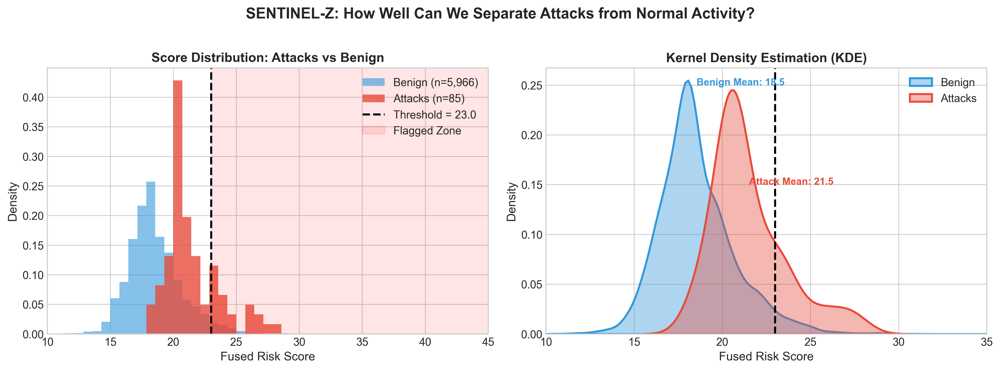
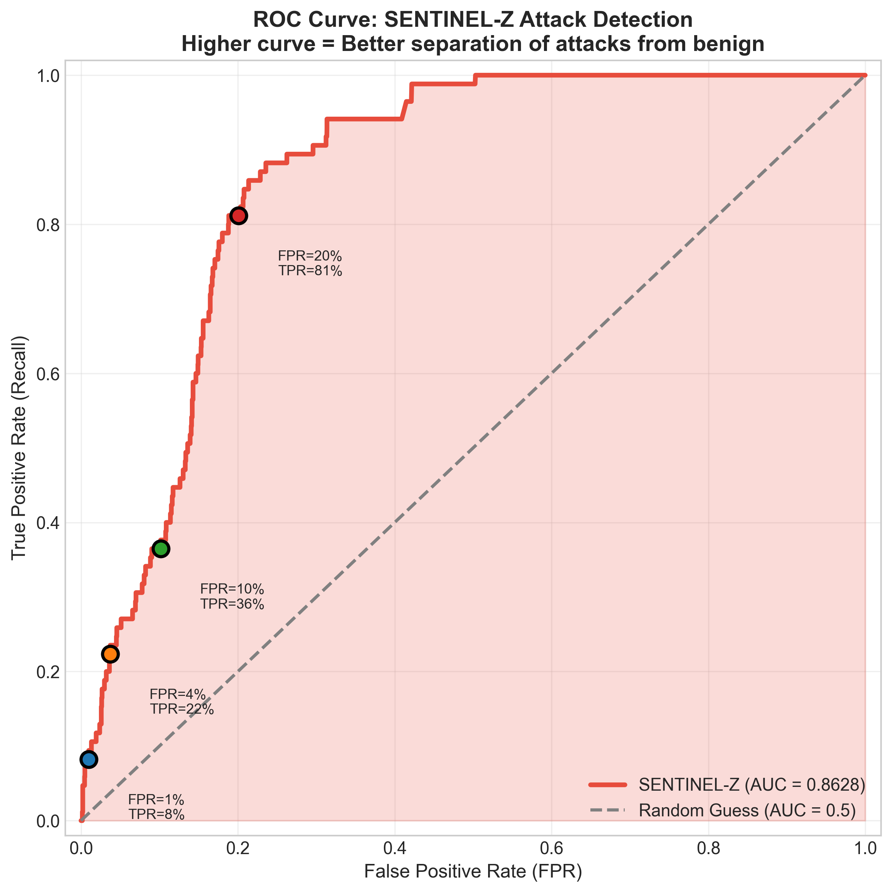
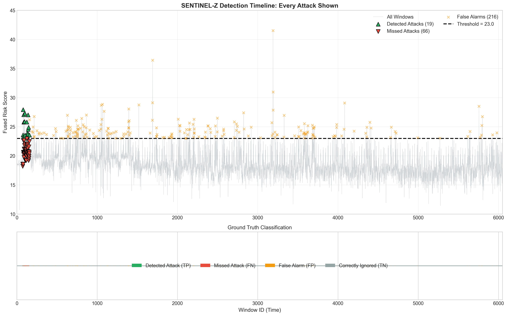
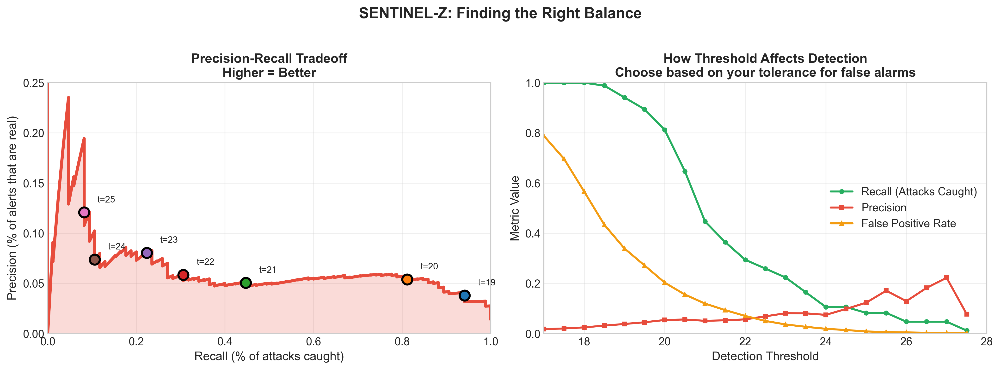
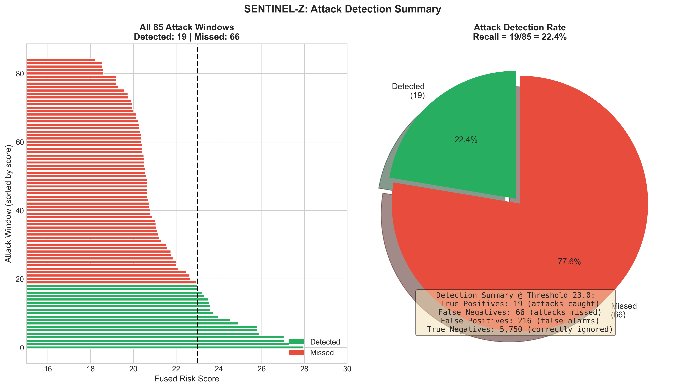
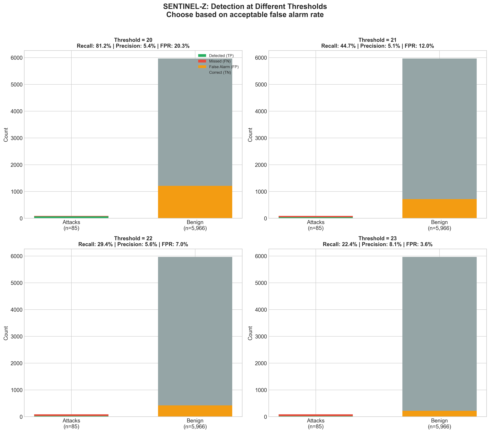

# SENTINEL-Z: An Intelligent Security Storyteller

### **Executive Summary**
SENTINEL-Z is an advanced "Intelligent Watchdog" designed to protect computer systems from sneaky, high-level hackers (known as APTs). Unlike traditional security software that looks for "wanted posters" of known viruses, SENTINEL-Z watches exactly how programs behave and talk to each other. It then turns complex computer data into a human-readable "attack story" so that security teams can understand exactly what happened in seconds.

---

## 🔄 **The Pivot: From "Geometry" to "Intent"**
Initially, this project focused on **Structural Analysis**. We were looking at the "shape" of computer interactions—think of it like looking at a crowd from a satellite and trying to spot a pickpocket by how they move through the street. 

**The Problem:** We discovered that normal programs (like Windows updates) often move in weird "shapes" too. This caused way too many false alarms (noise).

**The Pivot:** We shifted to **Semantic Risk Analysis**. Now, we don't just look at the *shape* of the movement; we look at the *actions* being taken.
*   **Old Way:** "There is a person running in the hallway." (Is it a runner or a thief?)
*   **New Way (Pivot):** "There is a person running in the hallway *holding a stolen TV*." 

By combining the "shape" of the network with the "meaning" of the computer commands (using our new **Semantic Risk Engine**), we've made the system much more accurate.

---

## 🛠️ **Learn the Technologies (Simply Explained)**

### 1. **Provenance Graphs (The Family Tree of Data)**
Imagine every action on a computer (opening a file, sending an email) is a dot, and every connection is a line. A "Provenance Graph" is a massive map connecting these dots. It shows us the history of every file—who created it, who moved it, and where it went.

### 2. **Zero-Shot Detection (The "Stranger Danger" Rule)**
Most security systems need to be shown thousands of examples of an attack to "learn" it. **Zero-Shot** means our system can spot a completely new, never-before-seen attack because it knows what "dangerous behavior" looks like fundamentally, even if it has never seen that specific hacker before.

### 3. **The Semantic Risk Engine (The Security Rulebook)**
This is a sophisticated "filter" we built. It knows that certain programs (like `PowerShell`) are powerful tools that hackers love to use. It categorizes every action as "Safe," "Suspicious," or "Dangerous" based on a rulebook of hacker behaviors (LOLBins).

---

## 🎯 **What we are achieving and HOW?**

### **The Objective**
To reduce **"Alert Fatigue."** Security officers are often overwhelmed by thousands of false alarms. We want to provide one single, high-confidence alert that says: *"This is definitely an attack, and here is exactly how it happened."*

### **The "How" (The 4-Step Process)**
1.  **Windowing:** we slice millions of computer events into 1-second "snapshots."
2.  **Structural Check:** We use math (Artificial Intelligence) to see if the *shape* of the snapshot looks unusual.
3.  **Behavioral Check (The Pivot):** We use our Semantic Engine to check if the *actions* in that snapshot are dangerous.
4.  **Fusion:** we combine both scores. A snapshot is only flagged if it looks weird AND acts dangerous.

---

## 📈 **Our Recent Breakthrough (Phase 4 Results)**

We tested the combined approach against **6,051 time windows** (85 attacks, 5,966 benign) from the DARPA Transparent Computing dataset:

### Key Metrics
| Metric | Phase 3 (Before Pivot) | Phase 4 (After Pivot) | Improvement |
|--------|------------------------|----------------------|-------------|
| ROC-AUC | 0.6572 | **0.8628** | +31% |
| Precision | 2.61% | **8.09%** | +210% |
| Recall | 18.82% | **22.35%** | +19% |
| False Positive Rate | 10.01% | **3.62%** | -64% |

### What These Numbers Mean
- **ROC-AUC of 0.86**: The system correctly ranks attacks higher than benign activity 86% of the time
- **Reduced False Alarms by 64%**: From ~600 false alarms down to ~215
- **Triple Precision**: When SENTINEL-Z flags something, it's now 3x more likely to be a real attack

---

## 📊 **Visual Analysis**

### 1. Score Distribution: Can We Separate Attacks from Normal?


The key insight: **Attack windows cluster between scores 18-28, while benign windows mostly stay below 22.** This separation is what makes detection possible.

### 2. ROC Curve: Overall Detection Quality


The curve shows how well we can trade off between catching attacks (Recall) and avoiding false alarms (FPR). Area Under Curve = **0.8628** (1.0 = perfect, 0.5 = random guessing).

### 3. Detection Timeline: Every Attack Visualized


This shows all 6,051 windows over time:
- **Green triangles**: Attacks we detected (19/85)
- **Red triangles**: Attacks we missed (66/85)
- **Orange X's**: False alarms (215)

### 4. The Precision-Recall Tradeoff


Security teams must choose: catch more attacks (high recall) or have fewer false alarms (high precision). This plot helps pick the right threshold.

### 5. Attack Detection Summary


All 85 attacks ranked by risk score. Green bars = detected, Red bars = missed. The threshold line shows our detection cutoff.

### 6. Threshold Selection Guide


Different thresholds for different use cases:
- **Threshold 20**: Catch 81% of attacks, but 20% false alarm rate
- **Threshold 23**: Catch 22% of attacks, only 3.6% false alarms (current setting)

---

## 🔬 **The Data Behind the Results**

### Dataset: DARPA Transparent Computing (Engagement 5)
| Metric | Value |
|--------|-------|
| Total Events | 9.7 million |
| Time Windows | 6,051 (1-second snapshots) |
| Attack Windows | 85 (1.4%) |
| Benign Windows | 5,966 (98.6%) |

### The Imbalance Challenge
Finding 85 attacks in 6,051 windows is like finding 85 needles in a haystack. Even a 4% false positive rate means ~240 false alarms vs only 85 real attacks. This is why **precision is inherently low** in APT detection.

---

## 🚀 **The Future Plan**

### Phase 5: Narrative Engine (Next)
Successful detection isn't enough; humans need to understand it.

**Goal:** Transform mathematical scores into plain-English attack stories:

```
CURRENT OUTPUT:
  Window 12345: Score 24.5, Label: SUSPICIOUS
  Risk Factors: ['unknown_subject', 'high_network_activity']

PHASE 5 OUTPUT:
  "At 11:42 AM, a suspicious PowerShell process was spawned by explorer.exe.
   The script used encoded commands to download a file via certutil.exe from
   external IP 203.0.113.50. This behavior matches 'Living off the Land'
   techniques commonly used by APT groups.

   Recommended: Isolate machine, capture memory dump, check for lateral movement."
```

### Phase 6: MITRE ATT&CK Classification
Map detected anomalies to the industry-standard attack framework:
- T1059.001: PowerShell Execution
- T1105: Ingress Tool Transfer
- T1071: Application Layer Protocol

### Phase 7: Real-Time Streaming
Move from batch analysis to live detection:
```
Live System Logs → Kafka Queue → SENTINEL-Z → Alert in < 1 second
```

### Phase 8: Cross-Dataset Validation
Prove generalization on other datasets:
- DARPA TC E3 (CADETS, TRACE, THEIA)
- Different operating systems (Linux, FreeBSD)

---

## 📁 **Project Structure**

```
sentinel-z/
├── data/                                # (gitignored) raw + processed datasets
│   ├── auto_processed/                  #   parsed events (9.7M rows)
│   └── model_ready/
│       ├── graphs/                      #   6,051 JSON graph files
│       ├── detection/                   #   Phase 4 results
│       └── labels.csv                   #   ground truth
├── src/sentinel_z/                      # The package
│   ├── pipeline/                        #   ETL building blocks
│   ├── ingestion/                       #   end-to-end DARPA ingest
│   ├── encoder/                         #   Phase 2 self-supervised encoder
│   ├── detection/                       #   Phase 3 + 4 detectors
│   │   ├── zero_shot_detector.py        #     structural baseline
│   │   ├── semantic_risk_engine.py      #     Phase 4 fusion (headline)
│   │   ├── semantic_resolver.py
│   │   └── semantic_graph.py
│   ├── narrative/                       #   Phase 5 attack-story scaffold
│   ├── realtime/                        #   Phase 6 streaming (stubs)
│   └── api/                             #   FastAPI server
├── scripts/
│   ├── visualize_detection.py           # generate all plots
│   └── visualizations/                  # output images
├── frontend/                            # Next.js dashboard
├── docs/                                # PROJECT_PLAN, roadmap/, reports/
└── tests/                               # smoke tests
```

---

## 🚀 **Quick Start**

```bash
# 1. Run detection pipeline
python -c "from src.sentinel_z.detection.semantic_risk_engine import run_phase4_pipeline; run_phase4_pipeline()"

# 2. Generate visualizations
python scripts/visualize_detection.py

# 3. Start API server
uvicorn src.sentinel_z.api.server:app --reload --port 8000
```

---

## 📚 **Glossary**

| Term | Simple Explanation |
|------|-------------------|
| **APT** | Advanced Persistent Threat - sophisticated hackers who hide for months |
| **Provenance Graph** | Map of how processes, files, and networks interact |
| **Zero-Shot** | Detecting attacks without prior examples of that specific attack |
| **LOLBin** | "Living Off the Land Binary" - legitimate tools hackers abuse |
| **ROC-AUC** | Score 0-1 measuring ranking quality (0.5=random, 1.0=perfect) |
| **Precision** | When we say "attack", how often we're right |
| **Recall** | Of all actual attacks, how many did we catch |

---

*Last Updated: January 21, 2026*

