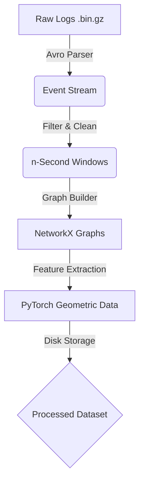

# Stage 1: Data & Graph Foundation

## 1. Overview
The foundation of SENTINEL-Z is the ability to transform raw system audit logs (CDM - Common Data Model) into temporal provenance graph snapshots. This stage handles the ETL (Extract, Transform, Load) pipeline, ensuring raw binary data is converted into efficient graph structures suitable for GNN processing.

## 2. Architecture

### Components
1.  **Ingestion:** Reads DARPA TC Avro binary files (efficient storage).
2.  **Windowing:** Slices the continuous event stream into fixed-time windows (e.g., 1 second). This creates the "frames" of our movie.
3.  **Graph Construction:** Converts events in a window into a directed graph.
    *   **Nodes:** System entities (Processes, Files, Sockets).
    *   **Edges:** System calls (Read, Write, Fork, Exec, Connect).
4.  **Feature Engineering:** Extracts node-level features (degree, centrality) and edge attributes.

## 3. Current Status: ✅ COMPLETE
*   **Accomplished:**
    *   Parsed ~300MB of compressed raw logs into 9.7 million events.
    *   Constructed 6,018 graph snapshots (learning from 5,935 benign and testing on 83 attack windows).
    *   Saved graphs as JSON for easy inspection and debugging.
    *   Implemented `GraphDataset` class for loading into PyTorch.

## 4. Optimization Strategies
Since we process millions of events, efficiency is critical.

*   **Tumbling vs. Sliding Windows:** Currently using tumbling (non-overlapping) windows for speed.
    *   *Optimization:* For higher accuracy at the boundary of attacks, we can implement **Sliding Windows** (e.g., 1s window, 0.5s stride), but this doubles storage/compute. Stick to tumbling for now.
*   **Graph Pruning:**
    *   *Strategy:* Remove "noise" nodes (temporary files, intense but irrelevant reads) that don't contribute to causal flow.
    *   *Metric:* Reduction in node count vs. retention of attack edges.
*   **Storage Format:**
    *   *Current:* JSON (Human readable, slow to load).
    *   *Optimization:* Migrate to **LMDB** or **PyTorch .pt** files for 100x faster loading during training.

## 5. Metrics & Targets
| Metric | Current | Target |
| :--- | :--- | :--- |
| **Ingestion Speed** | ~10k events/sec | >50k events/sec |
| **Graph Size** | Avg 200 nodes | Optimized <150 nodes |
| **Data Integrity** | Unknown | 0% Missing attributes |

## 6. Implementation Plan
This stage is effectively done, but we will run a **Validation Check** before training.

1.  **[Task]** specific checking of node feature normalization (ensure inputs to ML are 0-1 range).
2.  **[Task]** verify label correctness (align timestamps of graphs with ground truth attack windows).
