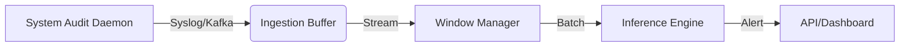

# Stage 6: Real-Time Pipeline

## 1. Overview
Moving from batch processing (reading existing files) to streaming (processing logs as they happen). This makes SENTINEL-Z a live defense tool.

## 2. Architecture

### Components
1.  **Ingestion Buffer:** A queue (python `collections.deque` or `multiprocessing.Queue`) to hold incoming logs so we never block the system.
2.  **Window Manager:** Groups logs by timestamps. When `t_current > t_window_end`, it dispatches the window to the model.

## 3. Current Status: 📝 PARTIAL
*   We have `realtime/` folder but it's mostly empty.
*   We have `build_dataset.py` which contains the windowing logic, but it's designed for offline files.

## 4. Optimization Strategies
*   **AsyncIO:**
    *   *Strategy:* The ingestion listener must be asynchronous. Inference (CPU/GPU heavy) should run in a separate Process (not Thread) to bypass Python GIL.
*   **Lazy Graph Construction:**
    *   *Optimization:* Don't build the full `NetworkX` object if the window has < 5 events (nothing interesting happened). Discard empty windows immediately.
*   **Data Structure:**
    *   Use `C` based structures (NumPy arrays) for the event buffer to minimize RAM usage.

## 5. Metrics & Targets
| Metric | Target |
| :--- | :--- |
| **Throughput** | > 10,000 events/second |
| **Latency** | < 1 second from "Event Occurred" to "Graph Built" |
| **CPU Usage** | < 10% on a standard server |

## 6. Implementation Plan
1.  **File Watcher:** Create a script that "tails" a live log file (simulating a real system).
2.  **Stream Processor:** Adapt `window_generator.py` to yield chunks from a stream instead of a file list.
3.  **Coordinator:** Write `sentinel_daemon.py` to manage the process pool.
