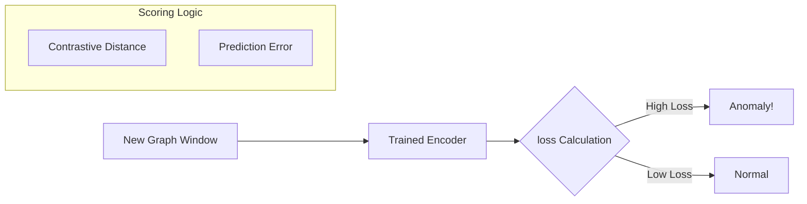

# Stage 3: Zero-Shot Detection

## 1. Overview
Once the "Brain" (Encoder) learns normal behavior, this stage implements the detection logic. The promise of "Zero-Shot" means we don't look for specific signatures (like antivirus). Instead, we measure **Surprise**: "How surprised is the model by this graph?" High surprise = Anomaly = Potential Attack.

## 2. Architecture

### The Scoring Function
The Anomaly Score $S(g)$ is a composition of:
$$S(g) = \alpha \cdot L_{contrastive} + \beta \cdot L_{prediction}$$

*   If the model fails to predict the edges (high prediction error), the behavior is unexpected.
*   If the embedding is far from its temporal neighbors (high contrastive loss), the context is broken.

## 3. Current Status: ❌ NOT STARTED
*   We have the `ZeroShotDetector` class skeleton in `self_supervised_encoder.py`.
*   We haven't calibrated the thresholds or run inference on the attack dataset.

## 4. Best Accuracy Strategies
*   **Dynamic Thresholding:**
    *   *Problem:* Fixed thresholds generate FPs during "busy" times (e.g., system updates).
    *   *Solution:* Use a sliding window for the threshold (e.g., `mean + 3*std_dev` of the last 5 minutes).
*   **Ensembling:**
    *   *Strategy:* Train 3 small models with different random seeds. Anomaly is confirmed only if 2/3 agree.Drastically reduces false positives.
*   **Calibration:**
    *   *Crucial Step:* We must run the model on a "held-out" benign dataset to determine the baseline distribution of errors.

## 5. Metrics & Targets
| Metric | Target |
| :--- | :--- |
| **Detection Rate (Recall)** | > 95% of attack windows |
| **False Positive Rate** | < 1% of benign windows |
| **Time to Detect** | < 2 seconds latency |

## 6. Implementation Plan
1.  **Calibration Script:** Write a script to pass all benign training data through the model and compute mean/std-dev of the loss.
2.  **Inference Pipeline:** Build the loop that takes new JSON graphs -> Model -> Score -> Alert.
3.  **Evaluation:** Run against the 83 known attack windows. Plot the ROC Curve.
